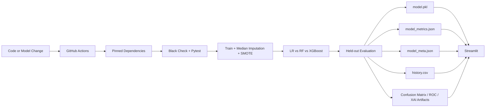

# 🩺 Explainable AI Diabetes Risk Prediction

> An educational healthcare screening project that combines machine learning, class balancing, model comparison, Explainable AI (XAI), automated retraining and a connected nutrition companion.

## 🌐 Live Applications

- **Diabetes AI:** https://medical-it-diabetes-ai-project-jkv5wwfmjmjugk5frfffut.streamlit.app/
- **NutriGuard AI:** https://nutriguard-ai-rrzi6rnezvcba9dhtgzlrm.streamlit.app/

## 🎯 Project Overview

The project explores how explainable machine learning can make diabetes-risk screening more transparent. The screening application accepts eight clinical variables from the Pima Indians Diabetes Dataset and returns an estimated statistical risk with explanatory information.

The current engineering workflow includes:

- Zero-coded clinical measurements treated as missing values
- Median imputation inside the training pipeline
- SMOTE applied only to the training split
- Logistic Regression, Random Forest and XGBoost comparison
- F1-score → Recall → ROC-AUC model-selection hierarchy
- Accuracy, precision, recall, F1-score and ROC-AUC reporting
- Threshold tuning for the F1/Recall trade-off
- SHAP-based explainability
- What-if analysis
- Automated GitHub Actions retraining
- Reproducibility metadata in `model_meta.json`
- Longitudinal metric history in `history.csv`
- Automated unit tests with pytest
- Clinical slate-blue Streamlit theme
- Docker container configuration
- Population-drift monitoring documentation
- Algorithmic fairness and dataset-generalization audit
- A unified Clinical Ecosystem Hub connecting the screener, NutriGuard and MLOps dashboard

## 🏥 Clinical Health Ecosystem

The repository now includes a navigation hub with three logical areas:

1. **Diagnostic Screener** — the existing diabetes-risk application.
2. **Nutritional Therapeutics** — a direct connection to the NutriGuard AI companion application.
3. **MLOps & System Metrics** — model comparison, validation artifacts, training history, drift monitoring and fairness limitations.

The hub uses Streamlit tabs for the high-level architecture while preserving the existing diagnostic and multipage functionality.

## 🔄 MLOps / CI-CD Architecture



The unified workflow is `.github/workflows/mlops_pipeline.yml`. It runs quality checks, retrains the models, generates evaluation artifacts and commits refreshed monitoring files. Generated model artifacts do not trigger the workflow again because the workflow listens to source/configuration changes rather than its generated outputs.

## 📊 Model Validation Strategy

Accuracy is intentionally **not used as the sole target metric**. In a screening-oriented project, recall and F1-score provide a more useful view of the false-negative/false-positive trade-off.

| Metric | Purpose |
|---|---|
| Accuracy | Overall classification correctness |
| Precision | Reliability of positive predictions |
| Recall | Ability to identify positive cases |
| F1-score | Balance between precision and recall |
| ROC-AUC | Ranking/discrimination performance |
| False Negatives | Direct monitoring of missed positive cases |

### Why F1 → Recall → ROC-AUC?

For a screening-oriented system, a **false negative** means a positive case was missed. That can be more consequential than sending a low-risk person for an additional check. Therefore the project prioritizes **F1-score**, then **Recall**, then **ROC-AUC** when selecting among models. Accuracy remains visible as supporting context rather than the only objective.

This is a modeling choice for an educational screening project, not a claim that the system is clinically validated.

### Training protocol

1. Load the Pima Indians Diabetes Dataset.
2. Treat zero-coded values in glucose, blood pressure, skin thickness, insulin and BMI as missing.
3. Split the data using stratification.
4. Median-impute inside the model pipeline.
5. Apply SMOTE **only to the training split**.
6. Train Logistic Regression, Random Forest and XGBoost.
7. Tune the classification threshold for the F1/Recall trade-off.
8. Evaluate on the held-out test set.
9. Select the model using F1-score, then Recall, then ROC-AUC.

The application reports the **actual held-out results**. It does not change the displayed accuracy to reach a target such as 80%.

## 🤖 Automated MLOps Metadata

Every successful training run records:

- UTC training timestamp
- Git commit SHA
- Selected model and threshold
- Full model comparison metrics
- Selected-model metrics in `history.csv`
- Evaluation images for confusion matrix, ROC-AUC and global feature importance

The MLOps dashboard reads these files so the visible monitoring state comes from the latest successful pipeline run rather than a hard-coded performance claim.

## 🔬 Explainable AI

The XAI Diagnostic Room provides an individual feature-contribution view using SHAP where supported. The generated global XAI artifact highlights the relative contribution of variables such as Glucose, BMI and Age.

The repository also contains an evaluation artifact generator at `scripts/generate_evaluation_artifacts.py` that creates:

- `assets/confusion_matrix.png`
- `assets/roc_auc_curve.png`
- `assets/shap_importance.png`
- `data/pima_indians_diabetes.csv`

## 📈 Population Drift Monitoring

The Pima dataset is a fixed historical cohort, while future users may have different biometric distributions. The MLOps dashboard documents a demonstration rule that would flag a feature when an approved incoming population stream deviates by more than **15%** from the training baseline.

The current project does **not** persist a live patient stream and therefore does not claim to have detected real population drift. The monitoring section documents how such a check could be implemented without pretending that a live clinical data feed exists.

## ⚖️ Algorithmic Fairness & Generalization

The dataset contains 768 female participants of Pima Indian heritage. Model performance therefore cannot be assumed to generalize safely to males or to people from other ethnic or demographic populations without external validation.

This limitation is part of the project's responsible-AI audit rather than something hidden from the reviewer.

## 📱 Connected NutriGuard Application

After diabetes-risk screening, the project connects users to **NutriGuard AI**, the companion educational nutrition application.

The intended flow is:

**Risk screening → Preferred Diet → Lifestyle → Manage Your Nutrition → Diabetes Prevention Checklist**

The NutriGuard application is a separate repository and deployment, linked from the Clinical Ecosystem Hub.

## 🧪 Automated Testing

`tests/test_pipeline.py` verifies that:

1. zero-coded clinical measurements are converted to missing values before pipeline imputation;
2. model probability output remains within the valid `[0.0, 1.0]` interval.

GitHub Actions runs these tests before retraining publishes new artifacts.

## 🎨 Clinical Design System

The project includes:

- Deep slate blue primary accent `#1E3A8A`
- Teal secondary accent `#0D9488`
- Off-white canvas `#F8FAFC`
- White content surfaces
- Muted green / amber / crimson status semantics
- Sans-serif typography

Theme configuration is stored in `.streamlit/config.toml`, with reusable CSS definitions in `styles.css`.

## 🐳 Docker

The root `Dockerfile` packages the Streamlit application with the pinned Python dependencies for reproducible local or cloud execution.

```bash
docker build -t diabetes-ai .
docker run -p 8501:8501 diabetes-ai
```

## 🧰 Technology Stack

- Python
- Streamlit
- Scikit-learn
- XGBoost
- imbalanced-learn / SMOTE
- SHAP
- Pandas
- NumPy
- Matplotlib
- Joblib
- pytest
- Black
- Docker
- GitHub Actions

All runtime and CI dependencies are pinned in `requirements.txt`.

## 📂 Project Structure

```text
Medical-IT-Diabetes-AI-Project/
├── .github/workflows/
│   └── mlops_pipeline.yml
├── .streamlit/
│   └── config.toml
├── assets/
│   ├── confusion_matrix.png
│   ├── roc_auc_curve.png
│   └── shap_importance.png
├── data/
│   └── pima_indians_diabetes.csv
├── models/                         # Reserved for future versioned model artifacts
├── src/
│   ├── __init__.py
│   ├── data_prep.py
│   └── inference_engine.py
├── tests/
│   └── test_pipeline.py
├── pages/
│   ├── 1_Clinical_Ecosystem_Hub.py
│   ├── 2_XAI_Diagnostic_Room.py
│   └── 3_Model_Metrics_Validation.py
├── scripts/
│   └── generate_evaluation_artifacts.py
├── app.py
├── model_training.py
├── train_model.py
├── predictor.py
├── preprocessing.py
├── explainability.py
├── results.py
├── config.py
├── model.pkl
├── model_metrics.json
├── model_selection.json
├── model_meta.json
├── history.csv
├── styles.css
├── Dockerfile
├── requirements.txt
├── README.md
└── LICENSE
```

`models/` is intentionally reserved rather than duplicating the currently deployed root `model.pkl`. This avoids breaking the existing Streamlit deployment while keeping the target modular structure clear for future migration.

## 🚀 Run Locally

```bash
git clone https://github.com/kashish-alt0786/Medical-IT-Diabetes-AI-Project.git
cd Medical-IT-Diabetes-AI-Project
python -m pip install -r requirements.txt
python -m pytest -q
streamlit run app.py
```

To run model comparison and refresh artifacts locally:

```bash
python train_model.py
python scripts/generate_evaluation_artifacts.py
```

## 🔐 Secrets & Deployment Security

The repository workflow does not contain deployment tokens or API keys. GitHub Actions uses its built-in `GITHUB_TOKEN` for committing model artifacts. If a future external deployment requires a token, it should be stored as a GitHub Actions secret and referenced through `${{ secrets.NAME }}` rather than committed to source code.

## 📚 Dataset

The project uses the **Pima Indians Diabetes Dataset**, originally associated with the National Institute of Diabetes and Digestive and Kidney Diseases. The commonly distributed dataset contains 768 observations, eight numeric input variables and a binary outcome. The dataset represents women aged 21+ from the Pima Indian population, so external validity is limited.

## ⚠️ Dataset Size Note

**Note:** This model is trained on the Pima Indians Diabetes Dataset (768 samples). Due to the dataset's limited size and population-specific sampling, optimization focuses on Recall and F1-score for screening-oriented evaluation rather than promising a particular accuracy target. SMOTE helps address class imbalance in the training split, but it does not create new clinical evidence.

## ⚠️ Limitations & Future Work

- The dataset is relatively small and population-specific.
- The model is an educational screening model, not a clinically validated diagnostic device.
- SMOTE can improve class-balance handling but does not create new clinical evidence.
- A higher accuracy score is not guaranteed by changing algorithms; real held-out performance is reported transparently.
- External validation on diverse clinical populations would be required before clinical use.
- Future work could include proper calibration analysis, external validation, uncertainty estimation, privacy-preserving learning and broader datasets.

## ⚕️ Medical Disclaimer

This application is intended for **educational and research purposes only**. It does not diagnose diabetes and should not replace consultation with a qualified healthcare professional. Predictions can be wrong and may not generalize to every population.

## 👨‍💻 Developer

**Kashish** — Independent AI Healthcare Project

GitHub: https://github.com/kashish-alt0786

Diabetes AI: https://medical-it-diabetes-ai-project-jkv5wwfmjmjugk5frfffut.streamlit.app/

NutriGuard AI: https://nutriguard-ai-rrzi6rnezvcba9dhtgzlrm.streamlit.app/

## 📄 License

MIT License
