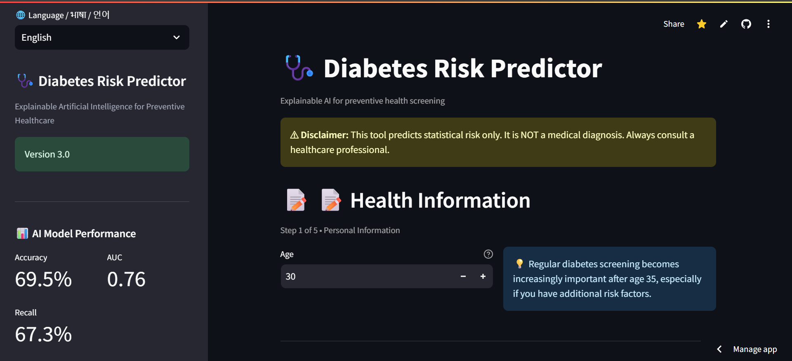
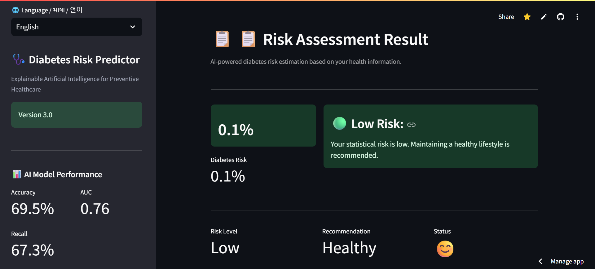

# 🩺 Explainable AI-Based Diabetes Risk Prediction System

> **An Explainable Artificial Intelligence (XAI) system for educational diabetes risk screening using XGBoost and SHAP.**


## 🌐 Live Demo

**Streamlit App:**
https://medical-it-diabetes-ai-project-jkv5wwfmjmjugk5frfffut.streamlit.app/

---

# 📌 Project Overview

## 🎯 Project Overview

Explainable AI-Based Diabetes Risk Prediction System is an educational healthcare application that combines **Explainable Artificial Intelligence (XAI)** with **diabetes risk screening**

The system allows users to:

- 🩺 Estimate their diabetes risk using an XGBoost machine learning model
- 📊 Understand predictions through SHAP Explainable AI
- 🩸 Estimate fasting blood glucose when laboratory results are unavailable
- 📏 Automatically calculate Body Mass Index (BMI)
- 🍽️ Receive educational lifestyle 
- 🌍 Use the application in **English, हिन्दी, and 한국어**
- 💻 Access the system through a lightweight Streamlit web application

This project was developed independently to explore how explainable machine learning can improve transparency, accessibility, and public understanding of AI-assisted healthcare screening.

The application is designed as an **educational healthcare screening tool** rather than a clinical diagnostic system.

---

## ✨ Features

- 🤖 XGBoost-based diabetes risk prediction
- 🔍 SHAP Explainable AI visualization
- 🌍 Multilingual interface (English, Hindi, Korean)
- 📏 Automatic BMI calculator
- 🩸 Blood glucose estimation using symptom-based screening
- ❤️ Blood pressure assessment
- 👨‍👩‍👧 Family history risk estimation
- 🥗 Personalized educational nutrition guidance
- 📱 Mobile-friendly Streamlit application
- ⚠ Educational medical disclaimer

---

## 📱 Application Preview

### 🏠 Homepage



---

### 📝 Patient Information Input



---

### 💡 Personalized Health Recommendation


---

## 🏗️ Project Architecture

```text
                  User Input
                       │
                       ▼
         Data Preprocessing & Validation
                       │
                       ▼
            XGBoost Risk Prediction Model
                       │
         ┌─────────────┴─────────────┐
         ▼                           ▼
  Risk Probability            SHAP Explainability
         │                           │
         └─────────────┬─────────────┘
                       ▼
      Personalized Health Recommendation
                       │
                       ▼
           Interactive Streamlit Interface
```

### 📊 Explainable AI (SHAP)

.png)
## 🌍 Problem Statement

Diabetes affects hundreds of millions of people worldwide, yet many individuals remain undiagnosed because regular laboratory screening is not always accessible.

Traditional AI prediction systems often behave as **black boxes**, making it difficult for users and healthcare professionals to understand why a prediction was made.

Additionally, many public screening tools provide only a numerical risk score without educational guidance that helps users understand possible lifestyle improvements.

This project explores how Explainable AI (XAI) can make diabetes risk screening more transparent and multilingual accessibility to improve health awareness.
---

## 🔬 Proposed Solution

 Explainable AI-Based Diabetes Risk Prediction System integrates machine learning, explainable AI, and preventive healthcare education into a single application.

### Core Components

- XGBoost diabetes risk prediction model
- SHAP Explainable AI visualization
- Symptom-based fasting glucose estimation
- Automatic BMI calculation
- Blood pressure and family history assessment
- Multilingual interface (English, Hindi, Korean)

Rather than replacing healthcare professionals, Explainable AI-Based Diabetes Risk Prediction System is designed as an educational decision-support tool that promotes awareness and encourages early medical consultation when necessary.
---

## 📈 Model Performance

The prediction model was trained using the **PIMA Indians Diabetes Dataset** and optimized using **GridSearchCV**.

| Metric | Score | Interpretation |
|---------|------:|----------------|
| Accuracy | **69.5%** | Overall prediction accuracy |
| Recall | **67.3%** | Correctly identifies high-risk patients |
| AUC-ROC | **0.76** | Good discrimination between risk groups |

### Why Recall Matters

For healthcare screening, missing a high-risk patient (false negative) can be more harmful than incorrectly flagging a healthy individual (false positive).

For this reason, the model was optimized to achieve a balanced recall while maintaining reasonable overall discrimination.

### Explainable AI

Instead of providing only a prediction, every result is accompanied by a SHAP explanation that identifies the factors contributing most to the prediction.

Examples include:

- Blood glucose
- BMI
- Age
- Family history
- Blood pressure
### Most Important Features

* Glucose
* BMI
* Age
* Diabetes Pedigree Function
* Blood Pressure

These factors are consistent with established diabetes risk factors reported in medical literature.

---

# 🔍 Explainable AI

Instead of simply predicting a probability, the model explains the prediction using **SHAP values**.

SHAP visualizations illustrate:

* Which features increased predicted risk
* Which features reduced predicted risk
* Relative importance of each feature

This improves transparency and trust compared to traditional black-box machine learning systems.

---

# 🌍 Multilingual Support

The application currently supports:

* 🇬🇧 English
* 🇮🇳 हिन्दी
* 🇰🇷 한국어

The multilingual interface aims to improve accessibility for diverse users.

---

# 💻 Technology Stack

### Machine Learning

* XGBoost
* Scikit-learn
* SHAP

### Data Processing

* Pandas
* NumPy

### Visualization

* Matplotlib
* SHAP

### Web Application

* Streamlit

---

# 📂 Project Structure

```text
Medical-IT-Diabetes-AI-Project/
│
├── app.py
├── predictor.py
├── preprocessing.py
├── explainability.py
├── results.py
├── config.py
├── requirements.txt
├── model.pkl
│
├── ui/
│   ├── input_form.py
│   └── sidebar.py
│
├── data/
│   └── diabetes.csv
│
├── README.md
└── LICENSE
```

---

# 🚀 Installation

Clone the repository

```bash
git clone https://github.com/kashish-alt0786/Medical-IT-Diabetes-AI-Project.git
```

Move into the project

```bash
cd Medical-IT-Diabetes-AI-Project
```

Install dependencies

```bash
pip install -r requirements.txt
```

Run the application

```bash
streamlit run app.py
```

---

# 📚 Dataset

This project uses the **PIMA Indians Diabetes Dataset**, published by the National Institute of Diabetes and Digestive and Kidney Diseases (NIDDK).

The dataset is widely used for educational machine learning research.

---

# 🎓 Learning Resources

The project was developed while studying:

* Kaggle Learn

  * Intro to Machine Learning
  * Pandas
  * Data Visualization
* OpenWHO

  * Digital Health
  * Ethics & Governance of AI for Health

---

# 🔮 Future Improvements

* 📷 AI-based food image recognition
* 🥗 Nutrition analysis
* 📈 Diabetes dashboard
* 📱 Progressive Web App enhancements
* 🏥 Federated Learning research
* 🔒 Privacy-preserving healthcare AI
* 🌐 Additional language support
* 📊 Clinical validation on diverse datasets

---

# ⚠ Medical Disclaimer

This application is intended **only for educational and research purposes**.

It **does not diagnose diabetes** and should not replace consultation with qualified healthcare professionals.

Predictions are generated using a machine learning model trained on a public dataset and may not generalize to every population.

Always seek professional medical advice before making healthcare decisions.

---

# Developed by: Kashish
Independent AI Healthcare Project
Medical Information Technology • Explainable AI • Digital Health

* GitHub: https://github.com/kashish-alt0786
* Kaggle: https://www.kaggle.com/code/kashish0000000/explainable-ai-diabetes-risk-prediction
* Live Demo: https://medical-it-diabetes-ai-project-jkv5wwfmjmjugk5frfffut.streamlit.app/

---

# 🙏 Acknowledgements

* National Institute of Diabetes and Digestive and Kidney Diseases
* Kaggle Learn
* OpenWHO
* Streamlit
* XGBoost
* SHAP
* Scikit-learn

---

# 📄 License

This project is licensed under the **MIT License**.

---

**Medical Information Technology • Explainable Artificial Intelligence • Digital Healthcare • 2026**
