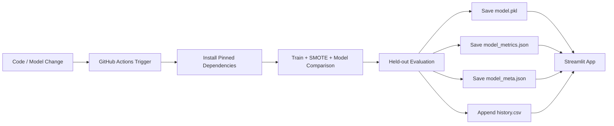

# 🩺 Explainable AI Diabetes Risk Prediction

> An educational healthcare screening project that combines machine learning, class balancing, model comparison and Explainable AI (XAI) to estimate diabetes risk.

## 🌐 Live Demo

**Streamlit:** https://medical-it-diabetes-ai-project-jkv5wwfmjmjugk5frfffut.streamlit.app/

**Nutrition companion:** https://nutriguard-ai-rrzi6rnezvcba9dhtgzlrm.streamlit.app/

---

## 🎯 Project Overview

The project explores how explainable machine learning can make diabetes-risk screening more transparent. The application accepts eight clinical variables from the Pima Indians Diabetes Dataset and returns an estimated statistical risk together with explanatory information.

The upgraded workflow now includes:

- SMOTE applied only to the training split
- Median imputation for zero-coded missing clinical measurements
- Logistic Regression, Random Forest and XGBoost model comparison
- Recall and F1-score as primary model-selection metrics
- ROC-AUC and accuracy reported as supporting metrics
- Threshold tuning for the F1/Recall trade-off
- SHAP-based individual explanations where supported
- Interactive what-if analysis
- Clinical input constraints
- Three Streamlit areas: Clinical Calculator, XAI Diagnostic Room and Model Metrics & Validation
- Automated GitHub Actions retraining with reproducibility metadata
- `model_meta.json` for the latest successful training timestamp and commit
- `history.csv` for longitudinal held-out metric monitoring
- Multilingual interface in the existing calculator: English, हिन्दी and 한국어
- Educational nutrition guidance and a companion nutrition application

## 🔄 MLOps / CI-CD Architecture



The workflow is triggered manually or when the training code, dependencies, or workflow definition changes. The training job receives the GitHub commit SHA, evaluates the models on the held-out test set, and commits the refreshed model and monitoring artifacts back to the repository. The Streamlit application reads the metadata and history files so the visible dashboard reflects the latest successful training state rather than a hard-coded performance claim.

## 📊 Model Validation Strategy

Accuracy is intentionally **not used as the sole target metric**. In a screening-oriented project, recall and F1-score provide a more useful view of the false-negative/false-positive trade-off.

The validation page trains three models under the same protocol and reports:

| Metric | Purpose |
|---|---|
| Accuracy | Overall classification correctness |
| Precision | Reliability of positive predictions |
| Recall | Ability to identify positive cases |
| F1-score | Balance between precision and recall |
| ROC-AUC | Ranking/discrimination performance |
| False Negatives | Directly monitors missed positive cases |

The application reports the **actual held-out results**. It does not alter or fabricate the accuracy percentage to reach a target such as 80%.

### Why F1 → Recall → ROC-AUC?

For a screening-oriented system, a **false negative** means a positive case was missed. That can be more consequential than sending a low-risk person for an additional check. Therefore the project prioritizes **F1-score**, then **Recall**, then **ROC-AUC** when selecting among models. Accuracy remains visible because it is useful context, but it is not treated as the only objective.

This hierarchy is a modeling choice for an educational screening project, not a claim that the system is clinically validated.

### Training protocol

1. Load the Pima Indians Diabetes Dataset.
2. Treat zero-coded values in glucose, blood pressure, skin thickness, insulin and BMI as missing.
3. Split the data using stratification.
4. Median-impute the training data inside the model pipeline.
5. Apply SMOTE **only to the training split**.
6. Train Logistic Regression, Random Forest and XGBoost.
7. Tune the classification threshold for the F1/Recall trade-off.
8. Evaluate on the untouched held-out test set.
9. Select the model using F1-score, then Recall, then ROC-AUC.

## ⚙ Automated Training Metadata

Every successful training run records:

- **Training timestamp** in `model_meta.json`
- **Git commit SHA** associated with the run
- Selected model and classification threshold
- Full model comparison metrics
- Selected-model metrics appended to `history.csv`

The Streamlit sidebar displays the latest training timestamp and commit when `model_meta.json` is available. The Model Metrics & Validation page plots the selected model's Accuracy, F1-score, Recall and ROC-AUC over successful runs.

## 🔬 Explainable AI

The XAI Diagnostic Room provides an individual feature-contribution view using SHAP when the selected model supports it.

The explanation is intended to show how inputs such as:

- Glucose
- BMI
- Age
- Blood pressure
- Insulin
- Diabetes pedigree function

influence the model output.

The page also contains a **What-If Analysis** so users can change selected inputs and observe how the model's estimated risk changes.

## 🖥️ Application Areas

### 1. Clinical Calculator
The existing main application provides the user-facing screening form, validation, risk result, educational guidance and disclaimer.

### 2. XAI Diagnostic Room
Accessible through Streamlit's native multipage navigation. Provides individual SHAP explanations and what-if analysis.

### 3. Model Metrics & Validation
Shows side-by-side model comparison, confusion-matrix counts, selected threshold, live training metadata and historical validation metrics.

## 📱 Companion Nutrition App

After receiving a diabetes-risk screening result, users can continue to the companion nutrition project:

**NutriGuard-AI:** https://nutriguard-ai-rrzi6rnezvcba9dhtgzlrm.streamlit.app/

The two projects are intentionally connected as:

**Risk screening → understand contributing factors → explore nutrition education.**

The nutrition application is educational and does not provide a substitute for professional dietary or medical care.

## 🧰 Technology Stack

- Python
- Streamlit
- Scikit-learn
- XGBoost
- imbalanced-learn / SMOTE
- SHAP
- Pandas
- NumPy
- Matplotlib
- Joblib
- GitHub Actions

All runtime dependencies are pinned in `requirements.txt` for reproducibility.

## 📂 Project Structure

```text
Medical-IT-Diabetes-AI-Project/
│
├── app.py
├── model_training.py
├── train_model.py
├── predictor.py
├── preprocessing.py
├── explainability.py
├── results.py
├── config.py
├── requirements.txt
├── model.pkl
├── model_metrics.json
├── model_selection.json
├── model_meta.json
├── history.csv
│
├── .github/
│   └── workflows/
│       └── retrain-model.yml
│
├── pages/
│   ├── 2_XAI_Diagnostic_Room.py
│   └── 3_Model_Metrics_Validation.py
│
├── ui/
│   ├── input_form.py
│   └── sidebar.py
│
├── notebooks/
├── data/
├── README.md
└── LICENSE
```

## 🚀 Run Locally

```bash
git clone https://github.com/kashish-alt0786/Medical-IT-Diabetes-AI-Project.git
cd Medical-IT-Diabetes-AI-Project
pip install -r requirements.txt
streamlit run app.py
```

To run the upgraded model-comparison workflow independently:

```bash
python train_model.py
```

## 🔐 Secrets & Deployment Security

The repository workflow does not contain deployment tokens or API keys. GitHub Actions uses the repository's built-in `GITHUB_TOKEN` for committing model artifacts. If a future deployment step requires an external token, it should be stored as a GitHub Actions secret and referenced through `${{ secrets.NAME }}` rather than committed to source code.

## 📚 Dataset

The project uses the **Pima Indians Diabetes Database**, originally associated with the National Institute of Diabetes and Digestive and Kidney Diseases. The commonly distributed dataset contains 768 observations, eight numeric input variables and a binary outcome. The dataset is known to represent women aged 21+ from the Pima Indian population, so external validity is limited.

## ⚠️ Dataset Size Note

**Note:** This model is trained on the Pima Indians Diabetes Dataset (768 samples). Due to the dataset's limited size and population-specific sampling, optimization focuses on Recall and F1-score for screening-oriented evaluation rather than promising a particular accuracy target. SMOTE helps address class imbalance in the training split, but it does not create new clinical evidence.

## ⚠️ Limitations & Future Work

- The dataset is relatively small and population-specific.
- The model is an educational screening model, not a clinically validated diagnostic device.
- SMOTE can improve class-balance handling but does not create new clinical evidence.
- A higher accuracy score is not guaranteed by changing algorithms; real held-out performance is reported transparently.
- External validation on a diverse clinical population would be required before any clinical use.
- Future work could include calibration analysis, external validation, uncertainty estimation, privacy-preserving learning and broader datasets.

## ⚕️ Medical Disclaimer

This application is intended for **educational and research purposes only**. It does not diagnose diabetes and should not replace consultation with a qualified healthcare professional. Predictions can be wrong and may not generalize to every population.

## 👨‍💻 Developer

**Kashish** — Independent AI Healthcare Project

GitHub: https://github.com/kashish-alt0786

Live Demo: https://medical-it-diabetes-ai-project-jkv5wwfmjmjugk5frfffut.streamlit.app/

## 📄 License

MIT License
